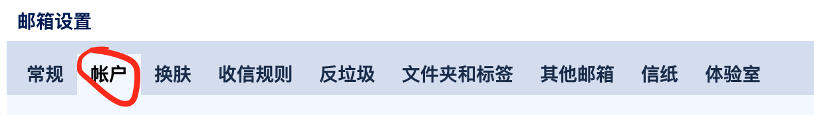
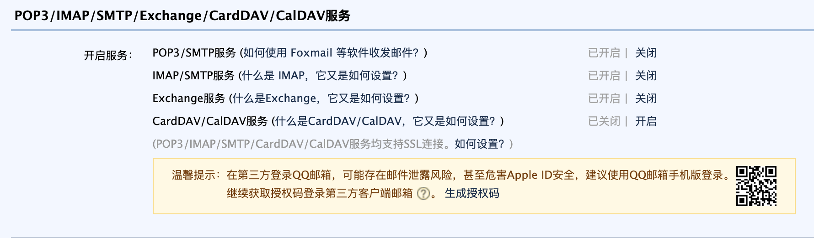

# 平安复旦自动打卡

使用python打卡平安复旦并使用qq邮箱推送

## 如何使用
1. python3 fudanDaily.py
2. 按照提示输入发送打卡推送的邮箱和token
3. 输入账号密码邮箱

## 说明
- 打卡时使用前一日地理位置信息。
- 打卡前会检测当日是否已打卡，避免重复提交。
- 如需变更打卡位置请提前停止自动打卡，到新位置手动打卡一次再开启（或赶在自动打卡时间前手动打卡）。
- 未经充分测试，不保证最终效果，请酌情使用。

---
### 打卡推送的qq邮箱
qq邮箱中选择邮箱设置->账户
 
下翻到如下 
 
开启pop3/SMTP 
再点击下方生成授权码 
授权码即为打卡推送的邮箱和token 